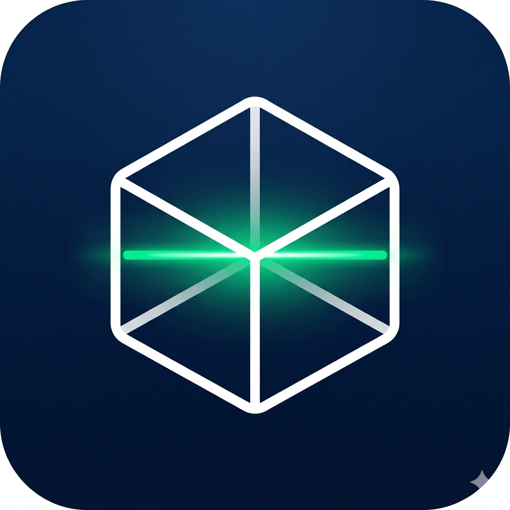

# BatchGuard

<p align="center">
  
</p>

<p align="center">
<b>Mobile inventory tracking powered by barcode scanning and on-device OCR.</b><br/>
Track products, detect expiry dates automatically, and reduce waste through smart inventory management.
</p>

<p align="center">


</p>

---

## What is BatchGuard?

**BatchGuard** is a React Native mobile application that automates inventory tracking using device camera capabilities.

Instead of manually logging products and expiry dates, users:

1. Scan a barcode
2. Automatically detect expiry dates via OCR
3. Verify data in a streamlined workflow
4. Maintain a synchronized inventory list

The project demonstrates practical use of **computer vision**, **mobile performance optimization**, and **scalable state architecture**.

---

## Demo

🎥 **Demo Video (Recommended)**
https://github.com/asad117/batchguard/assets/demo.mp4

<p align="center">
  
</p>

---

## Problem Statement

Manual inventory tracking often leads to:

* Expired products
* Data entry errors
* Poor stock visibility
* Time-consuming logging

BatchGuard reduces friction by turning a smartphone camera into an inventory scanner.

---

## Key Features

### Smart Scanning Engine

* Real-time barcode recognition
* OCR-based expiry date detection
* Vision Camera frame processing

### Verification Workflow

* Editable confirmation modal
* Quantity stepper controls
* Category assignment
* Brand correction support

### Inventory System

* Category-based organization
* Instant global updates using Zustand
* Cloud persistence via Google Sheets integration

### User Experience

* Haptic feedback interactions
* Guided camera overlays
* Minimal UI optimized for speed

---

## Engineering Highlights (Recruiter Section ⭐)

This project focuses on **real-world mobile engineering challenges**:

* Camera frame processing without UI blocking
* OCR parsing and date normalization
* Global state design using lightweight stores
* Hardware-first UX design
* Modular architecture for scalability

### Key Decisions

| Decision           | Reason                                   |
| ------------------ | ---------------------------------------- |
| Zustand over Redux | Minimal boilerplate, faster updates      |
| Vision Camera      | Native-level performance                 |
| Expo Prebuild      | Balance between speed and native control |
| OCR Automation     | Reduce manual input errors               |

---

## Tech Stack

| Layer     | Technology                       |
| --------- | -------------------------------- |
| Framework | React Native (Expo)              |
| Language  | TypeScript                       |
| Camera    | Vision Camera v3                 |
| State     | Zustand                          |
| OCR       | Frame Processors                 |
| UI        | Custom Components + Expo Haptics |

---

## Architecture

```
assets/
src/
 ├── components/     UI components
 ├── hooks/          Scanner & business logic
 ├── store/          Zustand state models
 ├── utils/          OCR + date helpers
docs/                Screenshots & demo assets
```

### Principles

* Separation of concerns
* Feature-driven structure
* Performance-first design
* Maintainable scaling

---

## Getting Started

### Prerequisites

* Node.js ≥ 18
* Expo CLI
* Physical mobile device

### Install

```bash
git clone https://github.com/asad117/batchguard.git
cd batchguard
npm install
```

Run:

```bash
npx expo start
```

Native build:

```bash
npx expo prebuild
npx expo run: android
```

---

## Roadmap

* [ ] Expiry reminder notifications
* [ ] Multi-user inventories
* [ ] Offline-first sync
* [ ] Inventory analytics dashboard
* [ ] Product database enrichment

---

## Lessons Learned

* Camera-heavy apps require strict performance awareness.
* OCR data is inconsistent and requires normalization logic.
* Lightweight state management improves developer velocity.
* UX clarity matters more than feature quantity.

---

## Author

**Asad Ahmad**
Full Stack Developer

GitHub: [https://github.com/asad117](https://github.com/asad117)
Portfolio: https://asad-personal-portfolio.netlify.app/
